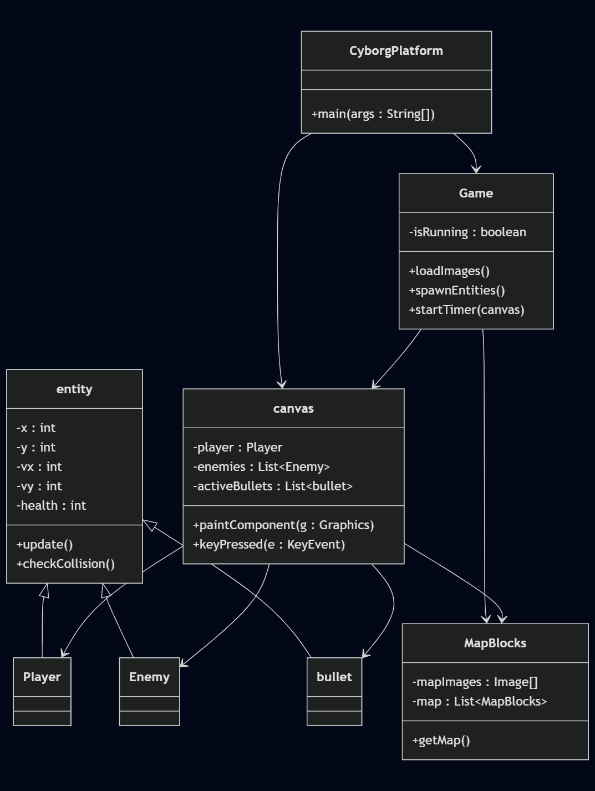
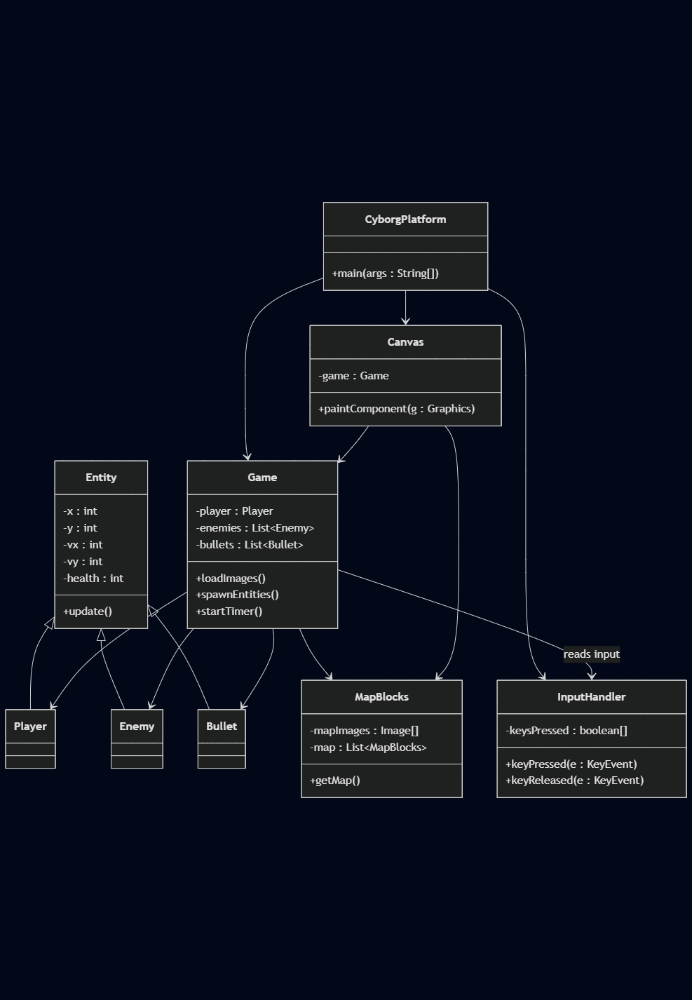
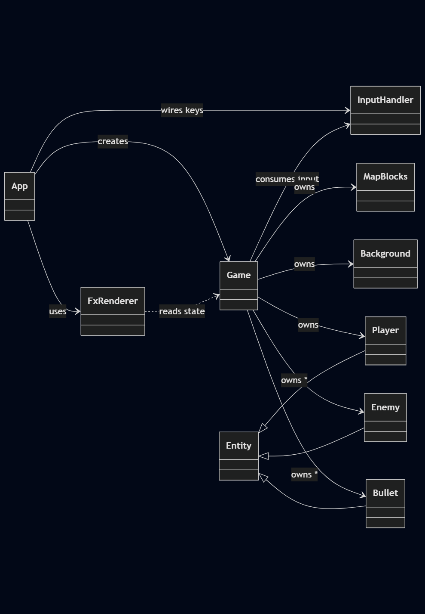
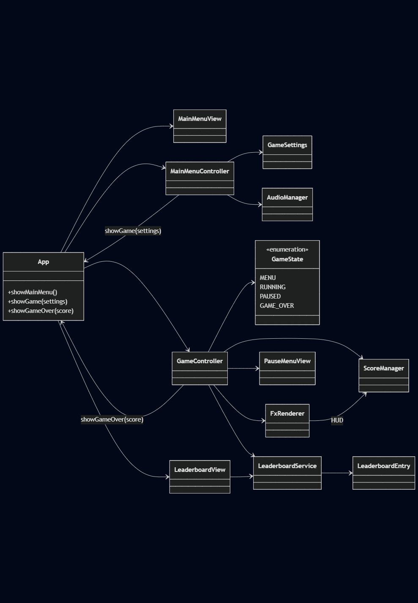
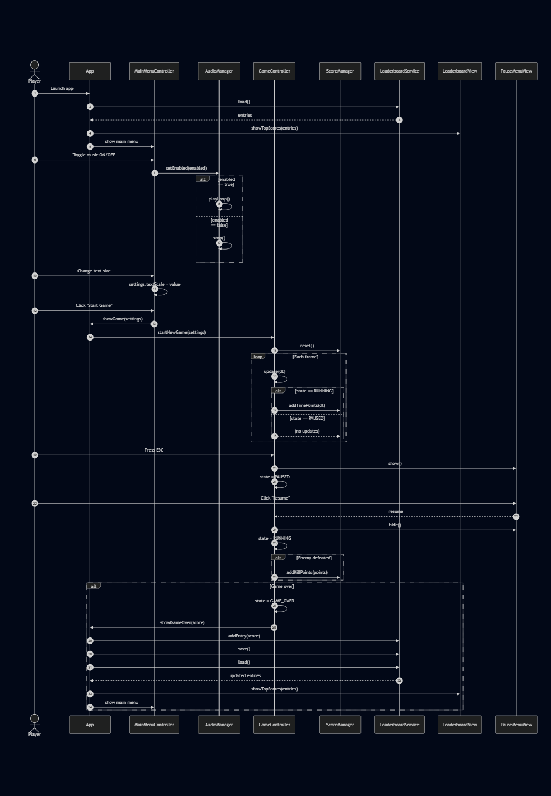
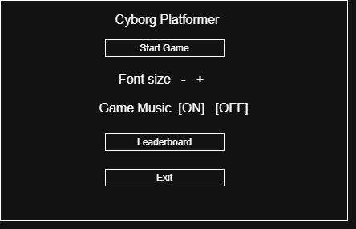
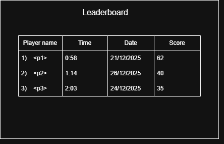
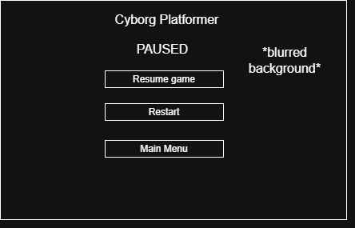
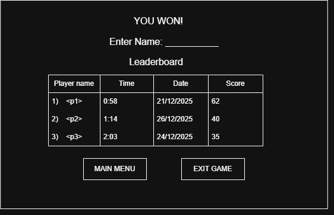

# Version 1
Version 1 is built around a small set of tightly coupled classes.
CyborgPlatform contains main and starts the game.
It creates a Game object, a fixed-size JFrame and a single Canvas object, adds the Canvas to the frame, then calls game.loadImages(), game.spawnEntities() and MapBlocks.getMap() before calling pack() and setVisible().

Game handles initialisation and the game loop.
loadImages() loads the background, HUD icons, player and enemy sprites and tile graphics. spawnEntities() resets the game state if it is not already won, creates a Player and a list of Enemy objects at hard-coded positions with health 2, and assigns them plus an empty Bullet list to static fields on Canvas.
startTimer(Canvas) then runs a loop using System.nanoTime(), calling Canvas.repaint() roughly 60 times per second while isRunning is true, making the game run at roughly 60 FPS.

Canvas extends JComponent and implements KeyListener, ActionListener and MouseListener. It acts as a central hub for both logic and rendering.
Most runtime state is stored in static fields: Player player, ArrayList<Enemy> enemies, ArrayList<Bullet> activeBullets, key-press state, camera offset, font and background image. Inside paintComponent (and helpers) it reads input, updates movement and jumping, applies gravity, checks collisions with MapBlocks.map, updates enemies and bullets, and then draws the background, tiles, entities and HUD.

The Entity superclass provides shared properties such as position, velocity, acceleration, health, ammo and an entitystate, plus basic update and collision behaviour.
Player, Enemy and Bullet extend Entity and specialise this logic (for example, enemy behaviour and Bullet travel).
MapBlocks stores tile data in static structures: mapImages for graphics and map, built by getMap(), for the layout parsed from Maps.txt.

This design works, but the frequent use of static fields, a mixed-responsibility Canvas and a busy-waiting loop in Game make the code hard to extend, test and reuse.

> **Figure 1:** UML class diagram of Version 1, showing `CyborgPlatform`, `Game`, `Canvas`, `Entity` and its subclasses, and `MapBlocks` with their current relationships and static dependencies.

## Version 2 - Planned Refactoring

In Version 2 we aim to separate responsibilities, specifically removing the heavy dependence on the Canvas object.
We also want to change the use of static objects within the Canvas class, since they are accessible by any other piece of code in the package, which opens the door for bugs and accidental changes to shared state.
Additionally the program can currently only have one save state, because most of the game data (player, enemies, bullets and map) is stored in static fields.
In the refactored design this state will be moved into normal instance fields on a dedicated Game or World class, and Canvas will be updated so that it is only responsible for drawing and called Canvas to fix naming conventions.
We also plan to introduce a separate InputHandler class to deal with key and mouse events, so input, game logic and rendering are no longer all mixed together in one place.

> **Figure 2:** UML class diagram of Version 2 planned refactoring.

# Version 2

## Refactoring strategy
During v2 creation, the codebase was maintained and refactored to improve structure, readability, and long-term maintainability while preserving behaviour.

Refactoring was carried out in a staged and prioritised manner to minimise risk. 
Architectural concerns with the highest impact were addressed first, followed by progressively lower-risk refinements. 
Initial work focused on ownership management and establishing a clear MVC structure, ensuring that Game acted as the model while rendering and input concerns were decoupled. 
Once responsibilities were stabilised, class and method naming was refined and long methods were decomposed to improve readability. 
After logic and rendering dependencies were resolved, the codebase was migrated from Swing to JavaFX. Finally, once structure and behaviour were stable, Javadocs were added to document the final design.

The largest architectural change was the full migration from Swing to JavaFX alongside restructuring into an MVC-style separation. 
This migration was implemented incrementally, introducing a JavaFX application entry point and moving rendering logic into a dedicated renderer, resulting in a fully functional JavaFX version of the game. 
Key milestones include migrating the game loop and window setup (commit 126135f, 08db1f7, a6e1842) and establishing an MVC layout where Game holds state and logic and rendering is handled separately (commit 47c7536, c33833b, 7c89872, b6dee89, 2607bab, b78c117 and subsequent draw* commits).

To reduce coupling and eliminate code smells, responsibilities were moved out of rendering classes and into dedicated model and controller classes. 
Earlier versions contained dependencies between entities and the canvas; these were removed so that Bullet, Enemy, and InputHandler no longer depended on the view layer (commits de76c11, a38dc7a, beb4e05, aa0a445, 2783355). 
Input handling was consolidated in InputHandler to decouple keyboard state from the canvas and allow the model to consume one-shot actions such as jump, shoot, and restart (commit ca46e58, 901d18c, bd69dc4).

Several refactorings directly addressed the code smells listed in the specification. 
Long methods were decomposed using helper functions (for example, Player.update() and Enemy.update()) to improve readability and follow KISS and DRY principles (commit ea29006). 
Conditional-heavy logic was reduced by extracting state representation into a dedicated class: EntityState replaced an inner class and clarified animation direction and state (commit 836db32). 
Responsibilities were also extracted into separate classes such as Background, which encapsulates parallax background drawing and removes mixed concerns from other classes (commit 4c5572f).

The main update loop and world orchestration were refactored so Game acts as the model “source of truth” for world state, assets, and entity lists. 
Over time, asset ownership and decision-making moved into Game (commits a691c65, e6853e5, 1bace70, 9e745d9), reducing scattered state and improving testability. 
Device refresh-rate dependency was removed by introducing an accumulator-based catch-up loop, ensuring logic updates run at a consistent 60Hz regardless of render rate (commit 619e0b7). 
Finally, shooting logic was refactored to strengthen encapsulation: Game manages the global bullet list while Player encapsulates cooldown and ammunition rules and spawns bullets through behaviour rather than exposed state (commit 27a2cbc). 
Documentation was finalised by converting comments into Javadocs across the codebase (commits 0065dfd, a032b58, 0ddbe87, bd69dc4, cd1b8c0, fae798e).

## Final Structure

The final codebase follows an MVC-style structure using JavaFX. 
The Model is primarily represented by Game, which owns the active world state: Player, a list of Enemy objects, active Bullet objects, the MapBlocks map, and camera offset. 
Game.update() advances the simulation each tick by consuming one-shot inputs, updating entities, and removing bullets/enemies when necessary. 
Entities share base physics/collision behaviour through the Entity superclass, while Player, Enemy, and Bullet implement specialised rules. 
Logical animation state and facing direction are stored in EntityState.

The View is implemented by FxRenderer (replaces Canvas), which draws the game using a JavaFX GraphicsContext. 
It reads state only through getters and does not own gameplay logic. 
Parallax background drawing is encapsulated in Background. 
The Bootstrap/UI layer is App, a JavaFX Application that creates the window, canvas, and starts the game loop. 
The game loop uses a fixed timestep accumulator to keep simulation speed consistent across devices.

The Controller/Input responsibility is handled by InputHandler, which records key presses/releases and exposes both continuous movement state (getKeysPressed) and one-shot actions (processJump, processShoot, processRestart). 
This prevents direct UI dependencies inside the model and reduces coupling between JavaFX event code and gameplay logic.

> **Figure 3:** UML class diagram of Version 2.

# Version 3
This section describes the planned extensions for Version 3 of the game.
The aim of these changes is to evolve the software while maintaining good software engineering practices, 
such as testability and extensibility.

### Planned Features:
- Start screen with music and settings
- In-game pause menu
- Score system and leaderboard

These features were chosen because they add meaningful functionality while demonstrating software evolution through new components, state management, and configuration-driven design.

## Start Screen
This will be the applications entry point that the user will first see. 
The aim is to replace the current behaviour of immediately starting the game with a more structured interface.

### Functions:
- Start Game
- Toggle background music
- Adjust text size
- Exit application

### Design
The start screen will be implemented using JavaFX and separated from gameplay logic.

Planned components:
- MainMenuView – JavaFX layout containing buttons, sliders, and selectors
- MainMenuController – Handles user interaction and updates configuration
- GameSettings – Stores user preferences such as text size, music enabled state, and selected difficulty
- AudioManager – Manages background music playback independently of the game loop

The game will only be initialised once the user selects “Start Game”, at which point the configured GameSettings object will be passed into the game setup.

### Reasoning:
This feature improves usability and accessibility while clearly separating application flow from gameplay logic.
It also provides a clean foundation for future extensions, such as save files or additional accessibility options.

## In-Game Pause Menu
An in-game pause menu will be accessible during gameplay via a key press (e.g. ESC).
When paused, the game state is preserved while all gameplay updates are suspended.

### Functions
- Resume game
- Restart level
- Return to main menu
- Exit game

### Design
Pause functionality will be implemented using explicit game state management.

Planned components:
- GameState (enum) – Defines valid states such as MENU, RUNNING, and PAUSED
- GameController – Controls behaviour based on the active game state
- PauseMenuView – JavaFX overlay displayed when the game is paused

While paused:
- Player, enemy, and bullet updates are skipped
- Rendering continues so the current scene remains visible
- Input handling is restricted to pause menu actions

### Reasoning
This feature introduces clear state transitions and avoids fragile, flag based logic.
It improves user experience while demonstrating structured control over the game loop and application state.

## Score System and Leaderboard
A scoring system will be introduced to reward player performance and provide progression feedback.
Scores will be recorded and displayed both during gameplay and across sessions via a persistent leaderboard.

### Functions:
- Scoring Criteria
> Scores influenced by:
Enemies defeated, time survived and player deaths or damage taken

### Design
Planned components:
- ScoreManager – Tracks and updates the player’s score during gameplay
- LeaderboardEntry – Represents a stored score record
- LeaderboardService – Responsible for saving and loading leaderboard data from persistent storage
- LeaderboardView – Displays top scores on the start screen or after game over
- Leaderboard data will be stored in a simple file-based format, allowing scores to persist between runs of the application.

### Reasoning
This feature adds replay value while demonstrating persistence, data management and UI integration.
It also allows for clear, testable behaviour.

> **Figure 4:** UML class diagram of Version 3.

> **Figure 5:** UML sequence diagram of Version 3.

> **Figure 6:** Lo-Fi diagram of Version 3 start screen.

> **Figure 7:** Lo-Fi diagram of Version 3 leaderboard.

> **Figure 8:** Lo-Fi diagram of Version 3 paused screen.

> **Figure 9:** Lo-Fi diagram of Version 3 end screen.

## Summary
The Version 3 features focus on structured software evolution rather than isolated gameplay changes.
Together, the start screen, pause menu, and score system improve usability, maintainability, and extensibility.

# Version 3 - Software Evolution

Version 3 evolves the refactored JavaFX codebase by introducing user facing features while preserving maintainability, testability, and structural clarity.
The primary additions were a start screen with settings, an in-game pause system, and a scoring and leaderboard system.
These features were selected to demonstrate structured software evolution rather than isolated gameplay changes.

Development followed a test-driven and incremental approach.
Initial commits focused on test scaffolding for menus, pausing, and endgame behaviour (7:test: AppMenuTest, 7:test: MainMenuTest) before full UI integration.
This reduced risk when introducing new state transitions and ensured existing behaviour was not broken.
Tests target logic and state changes rather than rendering, which was necessary due to differences between IntelliJ and Maven runners.
For example, the pause menu was assigned a stable JavaFX node ID to allow reliable querying across environments (7:fix: pause menu font matches settings from main menu).

The start screen was implemented as a dedicated JavaFX view rather than embedding logic into the game loop, following the Single Responsibility Principle and separation of concerns (7:feat: basic start screen/main menu added).
Menu-specific behaviour such as background animation, audio toggles, and accessibility options (text scaling) is handled independently of gameplay.
Text scaling is centralised in GameSettings, demonstrating encapsulation and DRY, and applied consistently across menus (7:feat: adjustable text size added /accessibility).
Audio playback is wrapped by AudioManager, reducing coupling to JavaFX APIs and aligning with Dependency Inversion and CUPID (composability) (7:feat: audio with toggle added - main menu implemented).

Pausing was implemented using explicit game states (RUNNING, PAUSED, GAME_OVER) rather than multiple boolean flags.
This keeps control flow simple (KISS) and avoids edge cases where updates or input could leak through while paused (7:feat: pause menu addded through App-input stopped too).
Game time tracking was corrected so paused duration is excluded from scoring, ensuring fairness (7:fix: game timer doesnt reset upon death or increase while paused).
Input state is cleared on pause to prevent held keys triggering unintended actions on resume.

The scoring system balances time survived, kills, and deaths while discouraging exploitative behaviour such as stat farming.
Scores are recalculated deterministically from tracked counters, and restart behaviour resets run statistics to maintain fairness (7:fix: counters and timer correctly track and reset).
ScoreManager follows the Single Responsibility Principle and remains independent of rendering and gameplay logic, supporting reuse and isolated testing.

Leaderboard persistence uses a binary file stored in the user’s home directory and is explicitly ignored by version control (.dat containing user specific game leaderboard data in binary ignored).
This avoids repository pollution and scales better than text-based formats.
Saving is restricted to once per run to prevent leaderboard spam, enforced through UI logic and state tracking (7:fix: save at end game can only be clicked once per run).

Overall, Version 3 demonstrates controlled software evolution.
Features were introduced through composable components, validated by tests and integrated without compromising the MVC separation established in Version 2.
The resulting system is more usable, extensible, and robust while adhering to core coding principles.